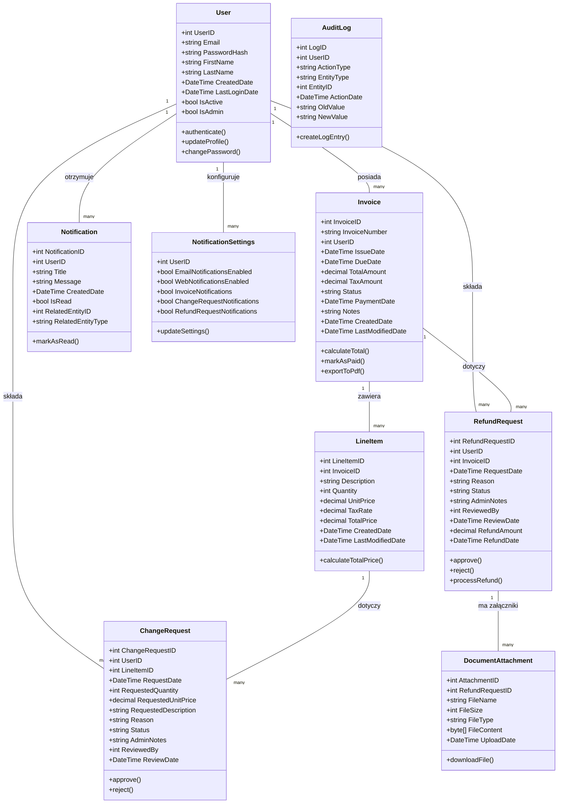
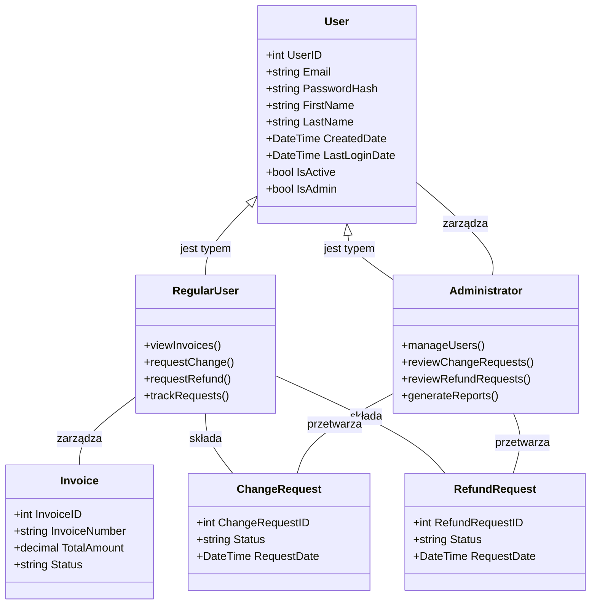
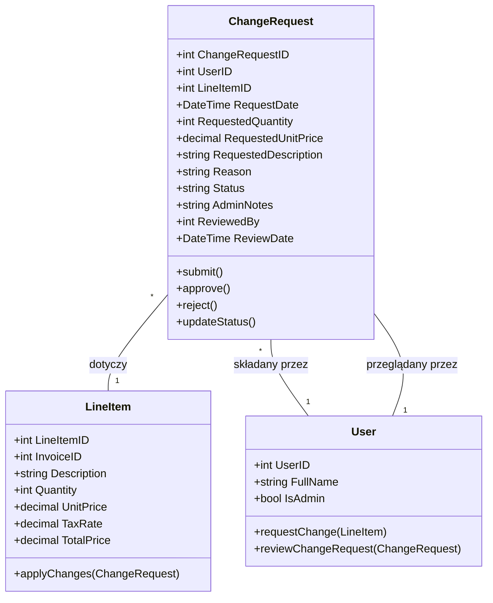
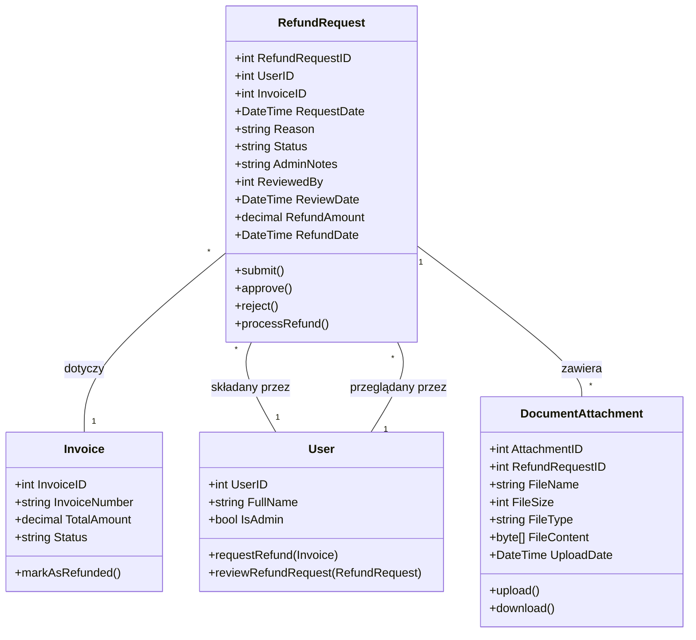

# Diagram Klas dla Systemu Zarządzania Fakturami

Poniższy diagram przedstawia relacje między głównymi encjami w systemie zarządzania fakturami.

## Diagram Głównych Encji

## Diagram Relacji Użytkownika z Systemem

## Diagram Procesu Wniosków o Zmiany

## Diagram Procesu Wniosków o Zwroty

