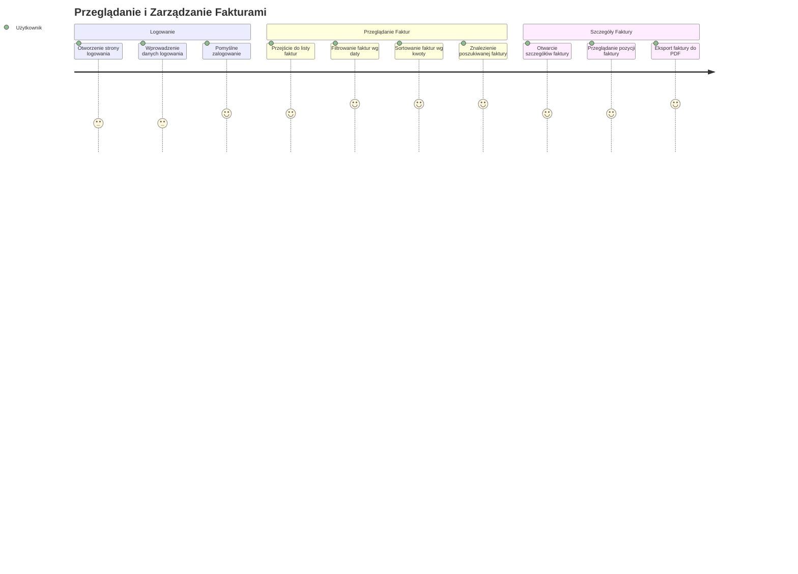
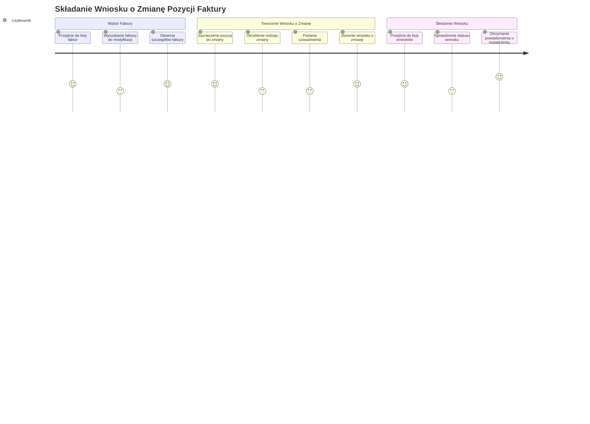
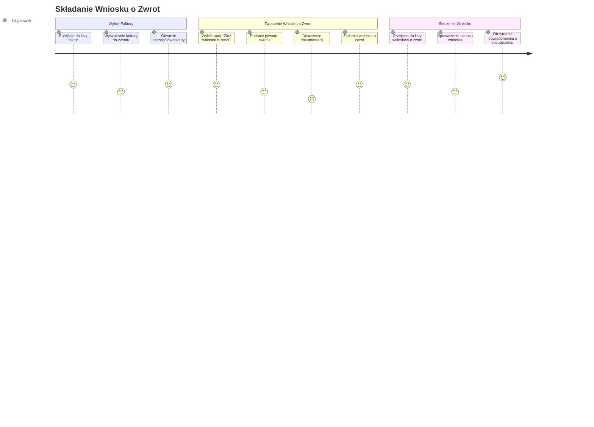
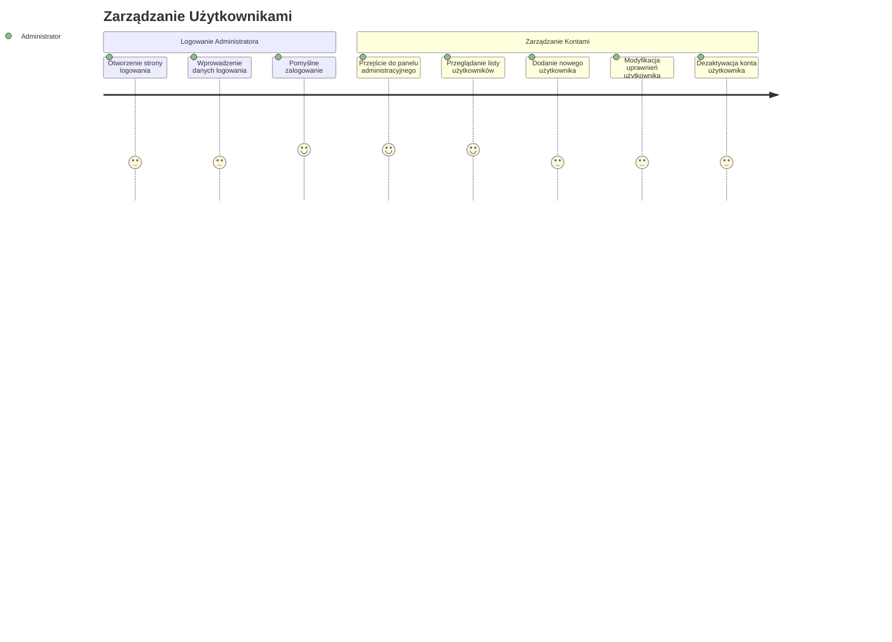
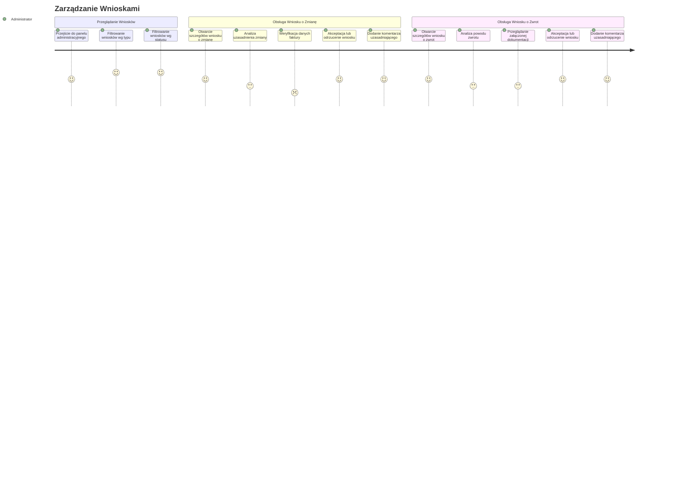

# Podróże Użytkownika w Systemie Zarządzania Fakturami

Poniższe diagramy przedstawiają typowe ścieżki użytkowników podczas korzystania z Systemu Zarządzania Fakturami. Diagramy ilustrują poziom satysfakcji użytkownika na każdym etapie.

## Standardowy Użytkownik

### Przeglądanie i Zarządzanie Fakturami

### Składanie Wniosku o Zmianę Pozycji Faktury

### Składanie Wniosku o Zwrot

## Administrator

### Zarządzanie Użytkownikami

### Zarządzanie Wnioskami

## Objaśnienie Poziomu Satysfakcji

Skala 1-5 oznacza poziom satysfakcji użytkownika na danym etapie:
1. Bardzo niezadowolony
2. Niezadowolony
3. Neutralny
4. Zadowolony
5. Bardzo zadowolony

Diagramy pokazują, w których momentach procesu użytkownicy doświadczają najwyższego poziomu satysfakcji, a gdzie mogą pojawiać się trudności lub frustracje wymagające uwagi w projektowaniu interfejsu.
